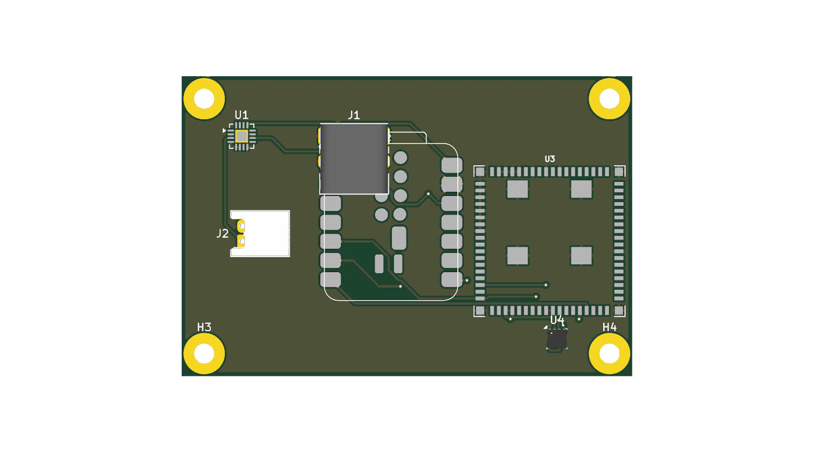

# Chameleon Mesh Node

> A rugged, solar-capable, dual-radio environmental telemetry node built on the Meshtastic + LoRa stack.

**Submission:** Seeed Studio Meshtastic Build-Off 2026
**Status:** Design complete & verified — routed, DRC-clean (0 errors), Gerbers exported. **Pre-fabrication** (first article not yet ordered).
**Hardware revision:** v1.0
**License:** Multi-license open source — CERN-OHL-S-2.0 (hardware), GPL-3.0-or-later (Meshtastic firmware variant), MIT (tooling). See [`LICENSE`](LICENSE) and [`NOTICE.md`](NOTICE.md).



*3D render (top). Bottom: [`assets/chameleon_mesh_node_v1_bottom.png`](assets/chameleon_mesh_node_v1_bottom.png). Renders are generated headlessly from the KiCad project via `kicad-cli pcb render`; the XIAO ESP32-C5 (U2) has no 3D model assigned and renders flat.*

## What it is

The Chameleon Mesh Node is a single-board, battery-and-solar-powered field appliance for long-duration off-grid telemetry. It joins a Meshtastic mesh on sub-GHz LoRa for resilient long-range messaging, reads local environment with an on-board sensor, and exposes a Wi-Fi / BLE side-channel for short-range provisioning and bulk-data offload.

Designed to be deployed once, walked away from, and forgotten about for months.

## Why dual radio

Most off-the-shelf Meshtastic nodes pick one path: a LoRa-only board that needs a phone to provision, or a Wi-Fi-only "smart sensor" that needs an AP within range. Neither survives a real off-grid deployment where the closest infrastructure is hours away.

This board pairs **two complementary radio subsystems on one PCB**:

| Subsystem | Role | Module |
|---|---|---|
| Long-range mesh | Meshtastic LoRa + GNSS time-sync + Wi-Fi scan for opportunistic uplink | Seeed **Wio-WM1110** (Semtech LR1110 + Nordic nRF52840) |
| Local-area + provisioning | Wi-Fi 6 / BLE 5 / 802.15.4 for setup, OTA, and bulk data offload to a passing operator's phone | Seeed **XIAO ESP32-C5** |

Both radios cohabit one ~60×40 mm 2-layer board, with explicit RF zoning and a shared ground pour designed to keep mutual desense within acceptable limits for an environmental-sensing-class duty cycle.

## Top-level specs

| | |
|---|---|
| Dimensions | ~60 × 40 mm, 2-layer FR-4 |
| MCU | Nordic nRF52840 (Meshtastic firmware host) + Espressif ESP32-C5 (companion) |
| Radios | Semtech LR1110 (sub-GHz LoRa, GNSS, passive Wi-Fi scan); Wi-Fi 6 / BLE 5 / 802.15.4 |
| Power input | USB-C 5 V / LiPo single-cell 3.7 V |
| Charger | Texas Instruments BQ24074 (USB-priority, solar-compatible up to 6 V VIN) |
| Battery connector | JST-PH 2-pin |
| Environmental sensor | Bosch BME280 (temperature, humidity, barometric pressure, I²C) |
| Quiescent target | < 50 µA in deep-sleep between Meshtastic transmissions |
| Operating temperature | -20 °C to +60 °C (designed; pending environmental test) |

## Repository layout

```
chameleon_mesh_node/
├── README.md                — this file
├── LICENSE                  — multi-license map (see also LICENSES/, NOTICE.md)
├── LICENSES/                — full license texts (CERN-OHL-S-2.0, GPL-3.0, MIT)
├── NOTICE.md                — third-party attribution
├── SUBMISSION_CHECKLIST.md  — Build-Off submission readiness gate
├── assets/                  — 3D renders
├── docs/
│   ├── architecture.md      — block diagram, radio zoning, antenna feeds
│   ├── build-guide.md       — BOM, assembly notes, first-power-on checklist
│   └── power-design.md      — solar input, charger, fuel-gauge, sleep budget
├── hardware/
│   ├── kicad/               — KiCad 10 project (schematic, PCB, footprints, gerber zips)
│   ├── gerbers/             — extracted v1.0 Gerbers + Excellon drill (fab-ready)
│   └── scripts/             — Python composers that regenerate schematic + PCB from source
├── firmware/                — Meshtastic nRF52840 variant (variant.h + platformio.ini) + ESP32-C5 stub
└── enclosure/cad/           — 3D-printable case (planned, post-fab)
```

The KiCad project is fully regenerable: `python3 hardware/scripts/build_schematic.py` rebuilds the schematic from the Python composer, and `python3 hardware/scripts/build_pcb.py` rebuilds the pre-placed PCB. You can wipe the `.kicad_*` files and reproduce the design from source.

## How it uses Meshtastic

The Chameleon Mesh Node **is a Meshtastic node.** The Nordic nRF52840 core of the
Wio-WM1110 runs the [Meshtastic firmware](https://github.com/meshtastic/firmware);
the Semtech LR1110 is its sub-GHz LoRa radio (plus GNSS time-sync and passive
Wi-Fi scan). It joins a Meshtastic mesh, announces itself, relays messages, and
publishes its BME280 environmental readings as Meshtastic telemetry — provisioned
over BLE with the standard Meshtastic mobile app.

Because the base board (Seeed Wio-WM1110 / nRF52840 + LR1110) is already supported
upstream, this project ships as an **incremental hardware variant**, not a new port.
The board-specific deltas (BME280 at I²C `0x76`, an ESP32-C5 companion-wake GPIO)
are captured in [`firmware/variant.h`](firmware/variant.h) +
[`firmware/platformio.ini`](firmware/platformio.ini), layered on the upstream
Wio-WM1110 build environment. See [`firmware/README.md`](firmware/README.md).

## Design state & verification

- Schematic ERC: **0 errors / 0 warnings** (KiCad 10).
- PCB: routed (2-layer, GND-stitching vias), 3 GND zones poured, RF-zoned placement.
- Post-route DRC: **0 errors / 14 warnings** (silkscreen/courtyard advisories on dense modules; reviewed and accepted — see `docs/`).
- Gerbers + Excellon drill exported (`hardware/gerbers/`, also zipped in `hardware/kicad/gerbers_v11.zip`).
- Board outline: ~60 × 40 mm, 2-layer FR-4; RF-zoned placement (radios on opposite edges) over a shared GND pour.

## Roadmap

- [x] Schematic netlist + ERC clean
- [x] PCB placement (RF-zoned) + routing + GND pour
- [x] DRC clean (0 errors) + Gerber/drill export
- [x] 3D render verification (headless)
- [ ] Order first-article prototype (JLCPCB / PCBWay)
- [ ] Bring-up: power smoke test, Meshtastic flash (SWD), mesh-join test
- [ ] Measure deep-sleep current vs. <50 µA target
- [ ] Upstream the Meshtastic variant (PR to meshtastic/firmware)
- [ ] Enclosure CAD

## License

Multi-license open source — see [`LICENSE`](LICENSE) for the per-component map and
[`LICENSES/`](LICENSES/) for full texts. Hardware: **CERN-OHL-S-2.0**. Meshtastic
firmware variant: **GPL-3.0-or-later**. Tooling/generators: **MIT**. Third-party
components retain their upstream licenses ([`NOTICE.md`](NOTICE.md)).

## Acknowledgments

- **Seeed Studio** for the Wio-WM1110 module, the XIAO ESP32-C5, and the Meshtastic Build-Off platform
- The **Meshtastic** project for the firmware and the mesh protocol
- **Semtech**, **Nordic**, **Espressif**, **Bosch**, **TI** for the silicon
- **KiCad** for the EDA toolchain (v10.0.3 used)

## Contact

See repository issues for design questions, build reports, or fork notifications.
